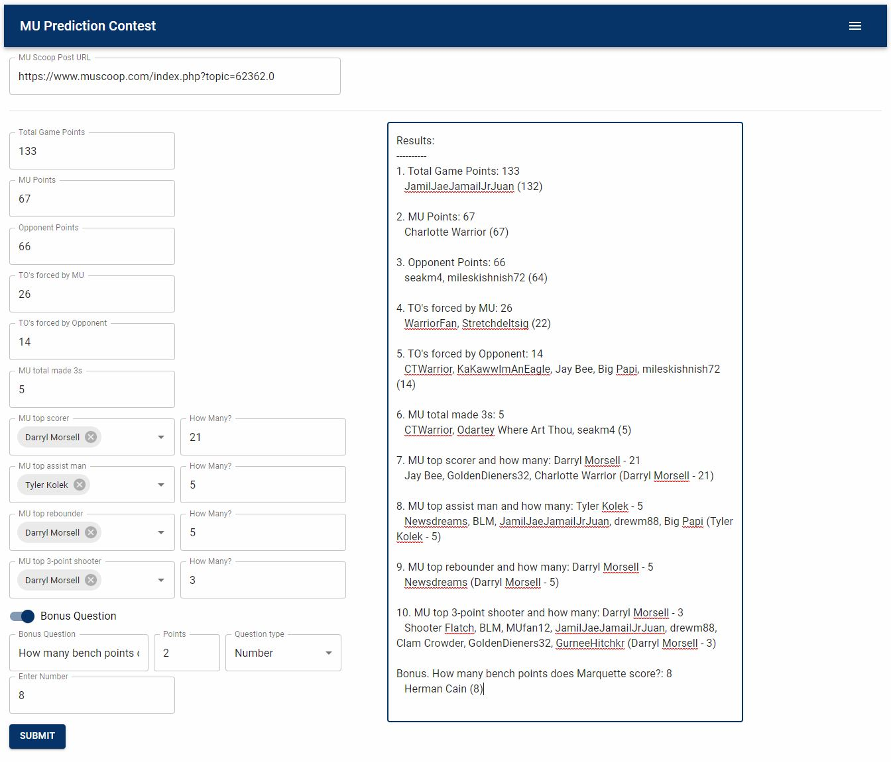

# mu-prediction-contest

[](https://coveralls.io/github/andrewmayer515/mu-prediction-contest)



A node.js script that scrapes the contents of [muscoop.com](https://www.muscoop.com/) using [Puppeteer](https://github.com/GoogleChrome/puppeteer#readme) to calculate prediction contest winners

## Rules
For this project, I based the prediction contest rules off of [this muscoop.com post](https://www.muscoop.com/index.php?topic=10.0).

Additionally,
* Copy/paste the format in the original post
* All answers must be written next to the question being asked (to the right of the colon)
* If a question asks for a player name, do not use nicknames (use a combination of player first and/or last name)
  * Acceptable: Markus, Howard, Markus Howard, or MHoward
  * Unacceptable: M2N, #0, etc.
* Do not 'Quote' another users prediction

## Setup
Download the latet LTS version of [Node](https://nodejs.org/en/), then run the following:
```
$ git clone https://github.com/andrewmayer515/mu-prediction-contest.git
$ cd mu-prediction-contest
$ npm i
```

## Start
Run the following command to build the UI and start the server:
```
$ npm start
```

## Quick Run
After following the setup steps if you want to see how the program works, run the following to get the results from [the 2013 NCAA Tournament game against Davidson](https://www.muscoop.com/index.php?topic=37247.0):
```
$ npm start
```

## Maintenance
Since some of the questions may refer to an individual player on the roster, the roster found in [server/src/constants](https://github.com/andrewmayer515/mu-prediction-contest/blob/master/server/src/constants/index.js) will need to be updated with the player names in a given year.

If a player has a nickname or alias they go by, to have the name included it can be added to the `ALIAS` object. The `key` being the name of the player, `value` being an array of aliases. 

```
ALIAS: {
  'Joseph Chartouny': ['joe c'],
},
```
